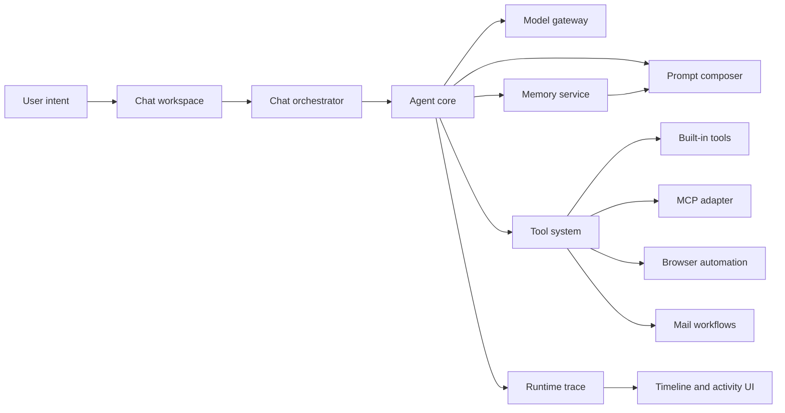

<div align="center">

# Super Agents

### A desktop workbench for local-native AI agents.

English | [简体中文](README.zh-CN.md)


</div>

Super Agents is a desktop shell for building, observing, and operating AI agents on your own machine. It treats chat, tools, memory, skills, permissions, knowledge bases, browser automation, mail, and runtime traces as parts of one local capability system instead of scattered features around a chatbot.


## Why It Exists

Most agent products stop at a prompt box plus a few tool calls. Super Agents is built around a different idea: the desktop app should become the agent's control plane.

- **The conversation is only one surface.** Tools, memory, skills, knowledge, settings, browser state, and execution traces are first-class workspace objects.
- **The runtime is native to the desktop.** The Electron main process owns local capabilities, credentials, permissions, sessions, and durable state.
- **Every action should be inspectable.** Runtime events are mapped into visible timelines, tool cards, status blocks, and structured logs.
- **Power stays bounded.** Permission policies, risk levels, approval flows, and workspace scope are part of the core runtime design.

## Capability System

| Area | What Super Agents Provides |
| --- | --- |
| Agent workspace | Chat turns, message visualization, right-side previews, runtime status, and tool activity. |
| Agent runtime | Agent profiles, prompt composition, model gateway integration, tool execution, finish signals, and session recovery. |
| Tool catalog | Built-in tools and MCP tools shown together with metadata, categories, schemas, and risk boundaries. |
| Memory | Structured long-term memory with local storage, search, deletion, and workspace-scoped prompt context. |
| Skills | Built-in skills plus user-imported or user-created skills managed from the desktop UI. |
| Browser automation | Page snapshots, click/type actions, screenshots, console diagnostics, and network diagnostics through the built-in Browser webview. |
| Mail | Account authorization, private credential storage, read workflows, draft creation, and send approval boundaries. |
| Self-administration | JSON-first `super-agents` and `super-agents-admin` commands for inspecting and maintaining local app state. |

## Runtime Model



## Project Map

```text
electron/main.ts                         Electron main-process entrypoint
electron/chat-orchestrator.ts            Chat turn lifecycle orchestration
electron/chat/                           Prompt context, runtime trace, turn event log
electron/agent-core/                     Agent, tool, permission, session, model gateway
electron/browser-automation-service.ts   Built-in Browser webview automation service
electron/mail/                           Mail accounts, auth, credentials, API/IMAP/SMTP helpers
electron/tool-catalog.ts                 Built-in and MCP tool catalog metadata
electron/memory-service.ts               Local long-term memory service
electron/builtin-skills/                 Built-in skills included with the app
src/features/chat/                       Chat workspace, previews, message visualization
src/features/tools/                      Tool catalog and MCP management UI
src/features/memory/                     Long-term memory management UI
src/features/skills/                     Skill list, import, and creation UI
src/features/settings/                   Model, MCP, permissions, remote control, appearance
tests/electron/                          Electron and agent runtime tests
tests/frontend/                          Frontend logic tests
```

## Quick Start

```bash
npm install
npm run dev
```

Development mode starts the Vite renderer, Electron main/preload compilation, and the Electron app together.

## Useful Commands

```bash
npm run build
npm run test:electron
npm run cli -- --help
npm run admin -- --help
```

- Run `npm run test:electron` after TypeScript, Electron, or frontend logic changes.
- Run `npm run build` after Vite, Electron entrypoint, preload, or main-process configuration changes.
- Run the CLI help commands after changing self-administration behavior.

## Engineering Principles

- Keep the agent runtime, tool system, memory, permissions, model gateway, and UI boundaries separate.
- Prefer small, typed modules that can be tested without booting the full desktop app.
- Treat tool inputs as structured data and validate them before execution.
- Keep long-term memory short, structured, deletable, and unable to override direct instructions.
- Surface runtime facts through trace events; derive timelines and activity views from those facts.
- Handle permissions, credentials, remote control, and mail sending conservatively.
- Do not commit local build artifacts, caches, or logs.

## CLI Harness

The desktop app exposes a scriptable administration layer for agents:

```bash
npm run cli -- --json status
npm run admin -- --json status
```

See [docs/super-agents-cli](docs/super-agents-cli/README.md) for command groups and JSON-first usage patterns.

## Star History

<a href="https://www.star-history.com/#kober-basket/super-agents&Date">
  <picture>
    <source media="(prefers-color-scheme: dark)" srcset="https://api.star-history.com/svg?repos=kober-basket/super-agents&type=Date&theme=dark" />
    <source media="(prefers-color-scheme: light)" srcset="https://api.star-history.com/svg?repos=kober-basket/super-agents&type=Date" />
    
  </picture>
</a>
