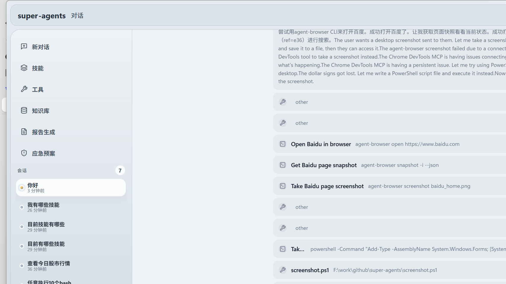
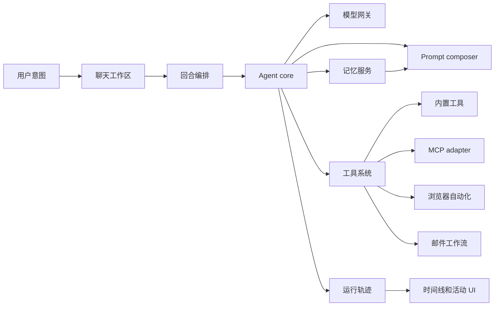

<div align="center">

# Super Agents

### 面向本地原生 AI agent 的桌面工作台。

[English](README.md) | 简体中文


</div>

Super Agents 是一个用于构建、观察和运行 AI agent 的桌面应用外壳。它不把聊天、工具、记忆、技能、MCP、权限、知识库、浏览器自动化、邮件和运行轨迹做成分散功能，而是把它们组织成同一个本地能力系统。



## 为什么做它

很多 agent 产品停留在“一个输入框加几次工具调用”。Super Agents 想做的是更底层也更实用的东西：让桌面应用成为 agent 的控制平面。

- **会话只是一个入口。** 工具、记忆、技能、知识库、设置、浏览器状态和执行轨迹都应该是工作台里的一级对象。
- **runtime 应该原生存在于桌面端。** Electron 主进程负责本地能力、凭据、权限、会话和持久化状态。
- **每一步都应该可观察。** 运行事件会被映射成时间线、工具卡片、状态块和结构化日志。
- **能力越强，边界越重要。** 权限策略、风险级别、审批流程和 workspace scope 都是 runtime 的核心设计，而不是事后补丁。

## 能力系统

| 模块 | Super Agents 提供什么 |
| --- | --- |
| Agent 工作区 | 会话回合、消息可视化、右侧预览、运行状态和工具活动。 |
| Agent runtime | Agent profile、prompt composition、模型网关、工具执行、完成信号和会话恢复。 |
| 工具目录 | 内置工具和 MCP 工具统一展示，并保留 metadata、分类、schema 和风险边界。 |
| 长期记忆 | 结构化本地存储、搜索、删除，以及按 workspace scope 注入 prompt context。 |
| 技能系统 | 内置技能，以及从桌面界面导入或创建的用户技能。 |
| 浏览器自动化 | 通过内置 Browser webview 提供页面快照、点击、输入、截图、console 和 network 诊断。 |
| 邮件工作流 | 账号授权、私密凭据存储、读信、草稿和发送审批边界。 |
| 自管理 CLI | JSON-first 的 `super-agents` 和 `super-agents-admin` 命令，用于检查和维护本地应用状态。 |

## Runtime 模型



## 项目地图

```text
electron/main.ts                         Electron 主进程入口
electron/chat-orchestrator.ts            聊天回合生命周期编排
electron/chat/                           prompt context、runtime trace、turn event log
electron/agent-core/                     agent、tool、permission、session、model gateway
electron/browser-automation-service.ts   内置 Browser webview 自动化服务
electron/mail/                           邮件账号、授权、凭据和 API/IMAP/SMTP 辅助模块
electron/tool-catalog.ts                 内置工具和 MCP 工具目录 metadata
electron/memory-service.ts               本地长期记忆服务
electron/builtin-skills/                 内置于应用的技能
src/features/chat/                       聊天工作区、预览和消息可视化
src/features/tools/                      工具目录与 MCP 管理界面
src/features/memory/                     长期记忆管理界面
src/features/skills/                     技能列表、导入和新建界面
src/features/settings/                   模型、MCP、权限、远程控制和外观设置
tests/electron/                          Electron 与 agent runtime 测试
tests/frontend/                          前端纯逻辑测试
```

## 快速开始

```bash
npm install
npm run dev
```

开发模式会同时启动 Vite renderer、Electron main/preload 编译和 Electron 应用。

## 常用命令

```bash
npm run build
npm run test:electron
npm run cli -- --help
npm run admin -- --help
```

- 修改 TypeScript、Electron 或前端纯逻辑后，运行 `npm run test:electron`。
- 修改 Vite、Electron 入口、preload 或主进程配置后，运行 `npm run build`。
- 修改自管理 CLI 行为后，确认两个 CLI help 命令仍可用。

## 工程原则

- 保持 agent runtime、工具系统、记忆、权限、模型网关和 UI 的边界清晰。
- 优先写小而明确、可单测的 TypeScript 模块。
- 工具输入必须作为结构化数据处理，并在执行前校验。
- 长期记忆要短、结构化、可删除，且不能覆盖直接指令。
- 运行事实进入 trace events，时间线和活动视图从事实事件派生。
- 权限、凭据、远程控制和邮件发送相关能力保持保守边界。
- 不提交本地构建产物、缓存或日志。

## CLI Harness

桌面应用提供一层可脚本化的自管理命令，方便 agent 检查和维护应用状态：

```bash
npm run cli -- --json status
npm run admin -- --json status
```

更多命令分组和 JSON-first 使用方式见 [docs/super-agents-cli](docs/super-agents-cli/README.md)。

## Star 历史

<a href="https://www.star-history.com/#kober-basket/super-agents&Date">
  <picture>
    <source media="(prefers-color-scheme: dark)" srcset="https://api.star-history.com/svg?repos=kober-basket/super-agents&type=Date&theme=dark" />
    <source media="(prefers-color-scheme: light)" srcset="https://api.star-history.com/svg?repos=kober-basket/super-agents&type=Date" />
    
  </picture>
</a>
