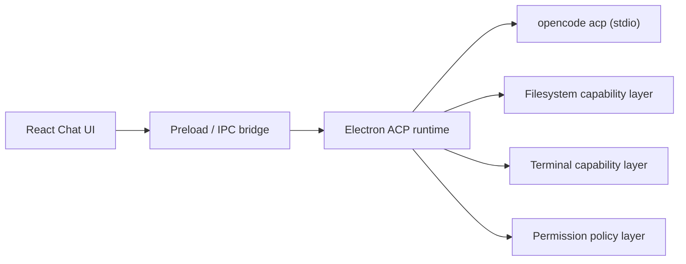

# Desktop Chat ACP Integration Design

**Date:** 2026-04-15

## Goal

Connect the `super-agents` desktop chat UI to the bundled `opencode` runtime through ACP so that the desktop app becomes a full ACP client for chat, file access, terminal execution, and permission handling.

This phase covers desktop chat only. Remote-control channels remain unchanged. Session history and resume are deferred until the base prompt loop is stable.

## Current Context

- The repo currently has a desktop shell with React renderer code in `src/` and Electron main-process services in `electron/`.
- The chat pane is a static shell today: `src/features/chat/ChatView.tsx` renders a disabled send button and only shows attachment preview state.
- Workspace bootstrap and most desktop capabilities are already exposed through IPC in `electron/main.ts` and `src/services/workspace-client.ts`.
- The bundled agent binary at `vendor/opencode/windows-x64/opencode.exe` already exposes `opencode acp`.
- A live ACP handshake against `opencode 1.4.0` confirms support for:
  - `initialize`
  - `session/new`
  - `session/prompt`
  - `session/list`
  - `session/load`
  - `session/set_config_option`
  - `fs/*`, `terminal/*`, and `session/request_permission` from the client side

## Scope

### In Scope

- Start and manage `opencode acp` as a stdio subprocess from Electron main.
- Send ACP requests and handle ACP notifications for a single desktop chat session.
- Replace the static chat shell with a working prompt loop.
- Expose all requested client capabilities:
  - `fs/read_text_file`
  - `fs/write_text_file`
  - `terminal/create`
  - `terminal/output`
  - `terminal/wait_for_exit`
  - `terminal/kill`
  - `terminal/release`
  - `session/request_permission`
- Auto-allow permission requests in phase 1, while still surfacing them in the UI for visibility.
- Support attachments in prompts using ACP content blocks.
- Detect auth-required states and instruct the user to run `opencode auth login`.

### Out of Scope

- Remote-control channels using ACP.
- Full session history UI based on `session/list` and `session/load`.
- Multi-session synchronization between desktop and Alma.
- Making `super-agents` itself an ACP server for external clients.

## Recommended Architecture

### Design Principle

`super-agents` should become an ACP client, not a second agent runtime. The app owns presentation, persistence, and local capability execution. `opencode` owns planning, tool orchestration, and response generation.

This keeps phase 1 small and preserves a clean path for phase 2, where `super-agents` may later expose an outward-facing ACP adapter for Alma.

## Session Model

Phase 1 uses a single active ACP session per chat window.

- The app initializes the ACP connection at runtime startup or on first chat interaction.
- The first user send creates a new session with `session/new`.
- Every subsequent send uses the same `sessionId` until the user starts a new chat.
- `New Chat` disposes the current local transcript state and creates a fresh ACP session on the next send.
- Session history is not listed or loaded in phase 1, even though `opencode` supports it.

This is intentionally narrow: it gets the end-to-end prompt loop stable before adding history replay semantics.

## Main-Process Responsibilities

Introduce a dedicated ACP runtime layer under `electron/` with three focused responsibilities.

### 1. ACP Process Transport

Own the `opencode acp --cwd <workspace>` subprocess and newline-delimited JSON-RPC transport.

Responsibilities:

- spawn the bundled `opencode` binary
- write ACP requests to stdin
- parse stdout notifications and responses
- collect stderr logs for diagnostics
- restart cleanly when the workspace changes or the process dies

Suggested files:

- `electron/acp/opencode-process.ts`
- `electron/acp/jsonrpc-transport.ts`

### 2. ACP Session Runtime

Own protocol state for the current desktop chat session.

Responsibilities:

- `initialize`
- track negotiated capabilities and auth methods
- create the active session via `session/new`
- submit prompts via `session/prompt`
- cancel active prompt turns via `session/cancel`
- translate incoming `session/update` notifications into UI events
- maintain current config options returned by `session/new`

Suggested file:

- `electron/acp/session-runtime.ts`

### 3. ACP Client Capability Handlers

Implement the methods `opencode` may call back into.

Responsibilities:

- file reads and writes against the local workspace
- terminal lifecycle and output buffering
- permission request handling

Suggested files:

- `electron/acp/client-capabilities.ts`
- `electron/acp/terminal-manager.ts`
- `electron/acp/file-access.ts`

## Renderer Responsibilities

The renderer should stay presentation-focused and not speak ACP directly.

### Chat UI

Update `src/features/chat/ChatView.tsx` and surrounding state so the composer can:

- send prompts
- show streaming assistant text
- show tool-call progress
- show permission decisions
- show terminal activity
- cancel an in-flight turn

### Renderer State

Add a desktop chat controller that stores:

- current transcript
- active turn state
- active session metadata
- current config options from ACP
- permission events
- terminal references
- auth-required status

Suggested files:

- `src/features/chat/useAcpChatController.ts`
- `src/features/chat/acp-chat-types.ts`

### IPC Surface

Expose a narrow renderer API instead of raw ACP:

- `chatBootstrap`
- `chatSendPrompt`
- `chatCancelPrompt`
- `chatNewSession`
- `chatSetConfigOption`
- event subscription for streamed updates

This keeps ACP details in Electron main and preserves flexibility for later protocol changes.

## Prompt and Content Mapping

Phase 1 should map existing desktop inputs into ACP content blocks as follows.

### User Text

- Composer text becomes a `text` content block.

### Attachments

- Text-like files with loaded content become embedded `resource` blocks when the content is already available.
- Images become `image` blocks when a base64 payload is available.
- Large or binary files fall back to `resource_link` with an absolute `file://` URI and metadata.
- Files outside the workspace are allowed as prompt context through embedded content or resource links, but ACP file callbacks remain workspace-scoped.

### Assistant Output

Translate ACP `session/update` events into local message models:

- `user_message_chunk` -> append or replay user content
- `agent_message_chunk` -> append streaming assistant text
- `tool_call` -> create tool execution row
- `tool_call_update` -> update tool status and content
- `plan` -> render plan block or lightweight checklist
- `available_commands_update` -> cache command metadata, not necessarily render in phase 1
- `config_option_update` -> refresh session config selectors

## File Access Strategy

Client filesystem callbacks should be implemented in Electron main and scoped to the active workspace root.

Rules:

- Require absolute paths, per ACP.
- Allow reads and writes only inside the current `workspaceRoot`.
- Reject paths outside the workspace root with a clear ACP error.
- Continue to support out-of-workspace prompt attachments through prompt content, not through ACP file callbacks.

This matches the expected coding-agent boundary and avoids turning the desktop app into an unrestricted system file proxy.

## Terminal Strategy

Implement ACP terminal methods locally instead of shelling them back through another abstraction.

Behavior:

- `terminal/create` spawns a child process in Electron main.
- Each terminal gets a generated terminal ID and retained output buffer.
- `terminal/output` returns current output and exit status.
- `terminal/wait_for_exit` resolves when the child exits.
- `terminal/kill` terminates the process but preserves buffered output.
- `terminal/release` frees retained resources.

Terminal content from ACP tool calls should be forwarded to the renderer as live-running activity cards. Phase 1 does not need a full embedded terminal emulator; text output blocks are enough.

## Permission Strategy

The user explicitly requested full permissions in phase 1, so the client policy should auto-allow permission requests.

Behavior:

- When `opencode` calls `session/request_permission`, the main process immediately returns the first allow-like option if present.
- The request and auto-allow decision are still emitted to the renderer so the user can see what was approved.
- If no allow option exists, reject with the safest available option and surface the mismatch.

This satisfies the requested behavior without hiding what the agent is doing.

## Authentication Handling

ACP initialization against `opencode` currently returns an auth method such as `opencode-login`.

Phase 1 should not embed auth flows into the app. Instead:

- If session creation or prompt execution fails because authentication is required, set chat state to `auth_required`.
- Render a clear message telling the user to run `opencode auth login` in a terminal.
- Allow retry after the user completes login outside the app.

This is the fastest path to a stable integration.

## UX Notes

Phase 1 UX should stay intentionally simple.

- Keep the current single chat surface.
- Replace the disabled send button with send and cancel states.
- Keep the preview pane and attachment behavior.
- Add lightweight activity blocks for:
  - tool calls
  - permission events
  - terminal output
  - auth-required notices
- Do not add a left-side session history list yet.

## Error Handling

The runtime should handle the following failure classes explicitly.

### ACP Process Startup Failure

- Show a blocking chat error if the bundled binary fails to launch.
- Include stderr excerpt for debugging.

### Transport Failure

- Mark the current turn as failed.
- Tear down the broken process.
- Offer retry, which re-initializes and recreates a session.

### Workspace Change

- Dispose the current ACP process and active session.
- Require a fresh session for the new workspace.

### Auth Required

- Convert to a first-class UI state instead of a generic error toast.

### Unsupported Update Shapes

- Log them and ignore them in the renderer.
- Do not crash the chat loop on unknown update variants.

## Testing Strategy

Testing should focus on the protocol seam, not just UI snapshots.

### Main-Process Tests

- JSON-RPC request/response correlation
- stdout line parsing
- session lifecycle transitions
- permission auto-allow selection
- terminal manager lifecycle
- workspace-root path enforcement

### Renderer Tests

- transcript updates from streamed assistant chunks
- tool-call status rendering
- cancel state transitions
- auth-required rendering

### Integration Tests

- spawn bundled `opencode acp`
- run `initialize`
- run `session/new`
- send a simple prompt
- verify streamed updates appear in UI state

## Future Compatibility with Alma

This design deliberately keeps ACP concerns behind a main-process runtime boundary so a future Alma-facing adapter can reuse the same internals.

Phase 2 can add:

- outward ACP server or adapter entrypoint for `super-agents`
- mapping between external session IDs and internal `opencode` session IDs
- optional shared or mirrored session behavior

Nothing in phase 1 should assume the renderer is the only possible ACP client.

## Final Recommendation

Implement phase 1 as a desktop-only ACP client integration:

1. `super-agents` manages the UI and local capabilities.
2. `opencode acp` remains the only underlying agent.
3. The app exposes all requested client permissions, with auto-allow behavior for permission prompts.
4. Session history and Alma integration remain separate follow-up steps.

This gives the project the shortest path to a real, usable desktop coding agent while preserving a clean upgrade path for Alma later.
